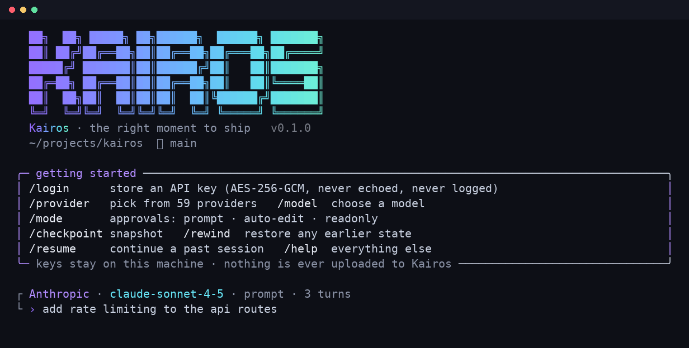
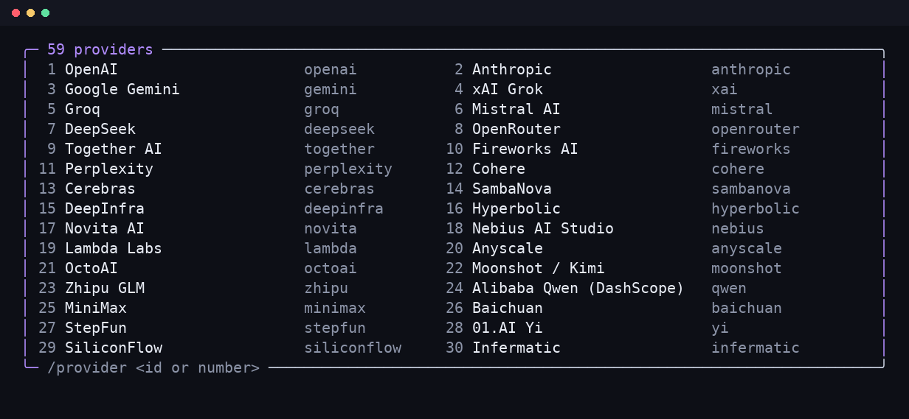
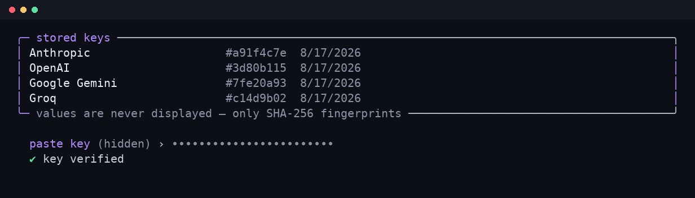
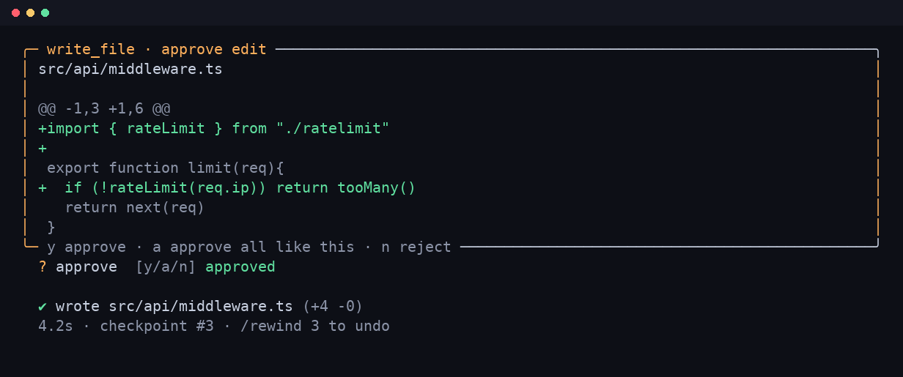
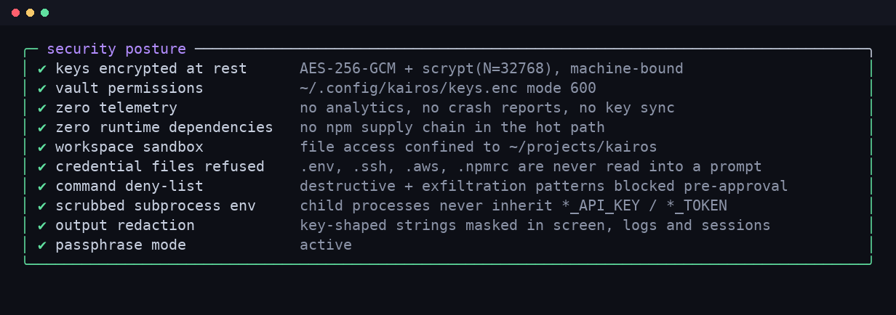

<div align="center">



### Kairos

**A secure, provider-agnostic coding agent for your terminal.**
59 providers. Your own API keys. An encrypted local vault. Zero telemetry, zero runtime dependencies.

[](https://www.npmjs.com/package/openkairos)
[](#license)
[](#)
[](#)

```bash
npx openkairos
```

</div>

---

## Why Kairos

Most terminal coding agents lock you into one vendor. Kairos doesn't.

- 🔌 **59 providers, one interface** — OpenAI, Anthropic, Gemini, Grok, DeepSeek, Groq, Mistral, Moonshot, Qwen, OpenRouter, Bedrock, Vertex, Ollama, LM Studio, vLLM, and more. Switch providers mid-session with `/provider`.
- 🔑 **Bring your own key, keep your own key** — no Kairos account, no proxy, no server in the middle. Your key talks to the provider directly.
- 🔐 **Real encryption, not obfuscation** — keys are stored in an AES-256-GCM vault, bound to your machine, and never rendered on screen again.
- 📦 **Zero runtime dependencies** — pure Node.js stdlib. Nothing in the supply chain to audit but this repo.
- ⏪ **Checkpoints and rewind** — every turn snapshots the files it touches. `/rewind 3` restores the tree *and* the conversation to that exact moment.
- 🩹 **Diff-first edits** — nothing is written to disk until you see the colored diff and approve it.

## Quick start

No install needed:

```bash
npx openkairos
```

Or install it globally so `kairos` is always on your PATH:

```bash
npm i -g openkairos
kairos
```

First run: `/provider` to pick a model provider, then `/login` to store your API key.

## See it in action

<table>
<tr>
<td width="50%">

**59 providers, pick any one**


</td>
<td width="50%">

**Keys go in, keys never come out**


</td>
</tr>
<tr>
<td width="50%">

**Every edit is a diff you approve**


</td>
<td width="50%">

**Check your own security posture**


</td>
</tr>
</table>

## Security

| Control | Implementation |
| --- | --- |
| Keys at rest | AES-256-GCM, key = scrypt(N=32768) over a machine secret + optional `KAIROS_PASSPHRASE` |
| Machine binding | 32 random bytes in `machine.key` (0600); copying the vault elsewhere is useless |
| Tamper detection | GCM auth tag verified on every unlock |
| File permissions | vault `0600` inside a `0700` config dir |
| Key entry | raw-mode hidden input — never echoed, never in shell history, never in argv |
| Key display | SHA-256 fingerprints only; the secret is never rendered |
| Redaction | known secrets + key-shaped strings masked in output, session files and prompts |
| Prompt hygiene | `.env`, `.ssh`, `.aws`, `.npmrc`, keystore files are refused by `read_file` |
| Sandbox | all file operations resolved and confined to the working directory |
| Command policy | deny-list for destructive and exfiltration patterns, applied before approval |
| Subprocess env | `*_API_KEY`, `*_TOKEN`, `*SECRET*` stripped from child processes |
| Telemetry | none, ever |

Run `/security` inside the app to see the live posture of your install.

## Commands

`/provider` `/model` `/login` `/logout` `/keys` `/mode` `/shell` `/checkpoint` `/rewind`
`/sessions` `/resume` `/diff` `/security` `/clear` `/exit`

Approval modes: **prompt** (default, ask for every mutation), **auto-edit** (write freely,
still deny-listed), **readonly** (analysis only — mutating tools are not even exposed to the model).

## Tools the agent has

`list_files` · `read_file` · `search_code` · `write_file` · `edit_file` · `delete_file` ·
`run_command` · `git` (status/diff/log/branch/stage/commit)

## Layout

```
cli/bin/kairos.js     entry + flags
cli/src/ui.js         ANSI TUI primitives (gradient, boxes, spinner)
cli/src/app.js        REPL, slash commands, approval UI
cli/src/agent.js      tool-calling loop
cli/src/client.js     OpenAI / Anthropic / Gemini streaming adapters
cli/src/providers.js  the provider registry
cli/src/keystore.js   encrypted vault
cli/src/security.js   sandbox, command policy, redaction
cli/src/session.js    sessions + checkpoints
cli/src/diff.js       LCS unified diff
```

## Running from source

```bash
git clone https://github.com/adamyasingh-05/kairos.git
cd kairos/cli
node bin/kairos.js
```

## Contributing

Issues and PRs welcome — see [CONTRIBUTING.md](./CONTRIBUTING.md). Kairos has zero runtime
dependencies by design — please keep it that way unless there's a very good reason not to.

This project follows a [Code of Conduct](./CODE_OF_CONDUCT.md). Found a security issue?
See [SECURITY.md](./SECURITY.md) — please don't open a public issue for it.

See [CHANGELOG.md](./CHANGELOG.md) for release history.

## License

MIT — see [LICENSE](./LICENSE).
